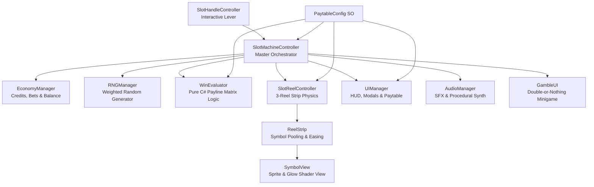
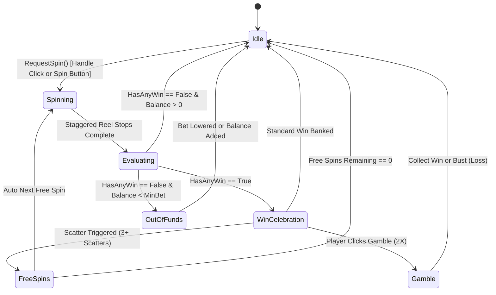

# Production-Grade 3x3 Video Slot Game

[-blue.svg?logo=unity)](https://unity.com/)
[](https://unity.com/srp/universal-render-pipeline)
[](https://unity.com/solutions/webgl)
[]()
[]()

> A feature-complete, casino-grade 3x3 video slot machine game developed in **Unity 6 (URP 2D)**. Designed with modular OOP architecture, data-driven ScriptableObjects, realistic reel physics, interactive 3D-styled lever handle mechanics, Wild & Scatter bonus modes, dynamic sound synthesis, and WebGL optimization.

---

## 📑 Table of Contents
- [📌 Game Overview](#-game-overview)
- [🎮 How to Run & Play](#-how-to-run--play)
  - [1. Play in Unity Editor](#1-play-in-unity-editor)
  - [2. Play WebGL Build (Local Server)](#2-play-webgl-build-local-server)
- [✨ Key Features & Game Feel ("Juice")](#-key-features--game-feel-juice)
  - [Interactive Mechanical Lever Handle](#-interactive-mechanical-lever-handle)
  - [Realistic Reel Animation & Physics](#-realistic-reel-animation--physics)
  - [Paylines & Winning Logic](#-paylines--winning-logic)
  - [Bonus Mechanics (Wilds & Free Spins)](#-bonus-mechanics-wilds--free-spins)
  - [Dynamic Audio & Sound Synthesis](#-dynamic-audio--sound-synthesis)
- [🏗️ Architecture & Thought Process](#️-architecture--thought-process)
  - [Design Principles](#design-principles)
  - [State Machine Flow](#state-machine-flow)
  - [Data-Driven Paytable & RTP Tuning](#data-driven-paytable--rtp-tuning)
  - [Zero-Dependency Easing & Pooling Engine](#zero-dependency-easing--pooling-engine)
- [📁 Project Structure](#-project-structure)
- [📊 Evaluation Checklist & Verification](#-evaluation-checklist--verification)

---

## 📌 Game Overview

The game simulates a premium classic 3-reel, 3-row slot machine with 5 active paylines (3 horizontal, 2 diagonal). Players place bets using their credit balance, pull the mechanical lever or press spin, and watch the staggered reels decelerate with elastic bounce physics.

```
+---------------+---------------+---------------+
|  Top Left     |   Top Mid     |   Top Right   |  <-- Payline 2 (Top Row)
+---------------+---------------+---------------+
|  Center Left  |  Center Mid   |  Center Right |  <-- Payline 1 (Center Row)
+---------------+---------------+---------------+
|  Bottom Left  |  Bottom Mid   |  Bottom Right |  <-- Payline 3 (Bottom Row)
+---------------+---------------+---------------+
     \                                     /
   Payline 4 (Diagonal \)             Payline 5 (Diagonal /)
```

### Symbol Tier & Payout Breakdown
| Symbol | Type | Base Payout (3x Match) | Description & Special Behaviour |
| :--- | :--- | :--- | :--- |
| **Diamond** | High Tier | **100x** | Ultra-rare jackpot symbol |
| **Triple 7** | High Tier | **50x** | Classic Vegas lucky 7 |
| **Gold Bell** | High Tier | **30x** | Vintage casino bell |
| **Cash Stack** | Mid Tier | **20x** | Currency bundle |
| **Horseshoe** | Mid Tier | **15x** | Lucky horseshoe |
| **Watermelon** | Mid Tier | **10x** | Juicy melon slice |
| **Grapes** | Mid Tier | **8x** | Grape cluster |
| **Plum** | Low Tier | **6x** | Sweet plum fruit |
| **Orange** | Low Tier | **5x** | Citrus fruit |
| **Lemon** | Low Tier | **4x** | Tangy lemon |
| **Cherry** | Low Tier | **3x** | Classic single cherry |
| **WILD** | Special | **50x** | Substitutes for **ANY** regular paying symbol |
| **SCATTER** | Special | **10x + 10 Free Spins** | 3 Scatters trigger **Free Spins Mode (2x Win Multiplier)** |

---

## 🎮 How to Run & Play

### 1. Play in Unity Editor
1. Open the project in **Unity 6 (6000.3.13f1 or newer)**.
2. In the `Project` tab, navigate to `Assets/Scenes/SlotGameScene.unity` and double-click to open.
3. Press the **Play** button at the top of the Unity Editor.
4. Interact using:
   - **Mouse Left Click** on the **Slot Machine Handle** (pull lever down to spin).
   - **Spin Button**: Initiates standard single spin.
   - **Auto Spin Button**: Toggles continuous automated spins.
   - **Bet +/- & Max Bet Buttons**: Adjusts bet per spin (10 to 500 credits).
   - **Paytable (?) Button**: Opens interactive payout breakdown dialog.

### 2. Play WebGL Build (Quick Evaluation)

The WebGL build is located at: `Build/WebGL Desktop/`

Because modern web browsers enforce CORS restrictions on local `file:///` URLs for WebAssembly (`.wasm`) and binary assets, run the build using any local HTTP server:

#### Option A: Python HTTP Server (Fastest & Recommended)
Run in terminal/PowerShell from the project root:
```bash
python -m http.server 8000 --directory "Build/WebGL Desktop"
```
👉 Open browser: **[http://localhost:8000](http://localhost:8000)**

#### Option B: Node.js `npx serve`
```bash
npx serve "Build/WebGL Desktop" -p 8000
```
👉 Open browser: **[http://localhost:8000](http://localhost:8000)**

#### Option C: VS Code Live Server / Antigravity
- In your IDE, right-click `Build/WebGL Desktop/index.html` $\rightarrow$ **Open with Live Server**.

#### Option D: Unity Editor "Build and Run"
- In Unity Editor, open **File > Build Profiles** (or **Build Settings**), select **Web - Desktop - Development**, and click **Build and Run**.

> **💡 Browser Audio Note:** Per modern browser autoplay policies, web audio unlocks after the first user interaction. Click anywhere on the game canvas or pull the lever to initialize audio.

---

### 🔍 Quick Evaluator Verification Checklist
When evaluating the build, verify these core mechanics & "juice" details:
- [x] **Mechanical Lever Handle**: Hover over the red knob for feedback; click to initiate full 4-stage pull-down, vibration hold, and elastic spring recoil.
- [x] **Staggered Reel Deceleration**: Reels spin at high speed with top-buffer wrap, then stop sequentially (Left $\rightarrow$ Middle $\rightarrow$ Right) with overshoot bounce.
- [x] **Near-Miss Scatter Anticipation**: When 2 Scatters land on reels 1 & 2, the landed scatters pulse with golden energy and the 3rd reel spins longer with tension audio.
- [x] **Winning Symbol Highlight & Pulse**: Winning paylines trigger a coordinated scale-pulse and color-flash on matching symbols via `EasingHelper`.
- [x] **Synchronized Score & Balance Rollup**: The win modal, bottom bar `WIN:`, and HUD `CREDITS:` roll up in 100% mathematical lockstep; clicking during tally instantly snaps to the final sum.
- [x] **Distinct Big Win & Mega Win Modals**: Distinct animated banners, themes, particle flare, and sound fanfares for Big Win vs. Mega Win vs. Free Spins.
- [x] **Free Spins Bonus Mode**: 3 Scatters award 10 Free Spins with a 2x win multiplier and dedicated active HUD banner.
- [x] **Economy & Betting Controls**: Increase/decrease bet increments (10 to 500), Max Bet shortcut, and automated Auto Spin mode.


---

## ✨ Key Features & Game Feel ("Juice")

### 🕹️ Interactive Mechanical Lever Handle
- **Mouse & Pointer Integration**: Fully interactive click-and-drag or tap target on the slot handle knob and arm.
- **4-Stage Animation Controller**:
  1. `Handle_Idle`: Subtle ambient breathing posture.
  2. `Handle_PullDown`: Rapid downward stroke with mechanical socket anticipation and frame deceleration.
  3. `Handle_HoldDown`: Mechanical high-frequency vibration loop while reels are actively in motion.
  4. `Handle_ReleaseUp`: Elastic spring-back recoil (`EaseOutBack`) restoring the handle when spin outcomes are ready.
- **Hardware Agnostic Fallback**: Includes a pure procedural tweening fallback ([`EasingHelper.cs`](file:///G:/Unity%20Games/Underpin%20Services%20Task/Assets/Scripts/Utils/EasingHelper.cs)) that seamlessly drives the handle even if animator controllers are bypassed.

### 🌀 Realistic Reel Animation & Physics
- **Anticipation Windup**: Reels exhibit a slight reverse pull-up before accelerating downward into full spin velocity.
- **Infinite Recycling Illusion**: Symbol view pool dynamically wraps symbol positions within `RectMask2D` clipping viewports to avoid memory allocation or GC spikes.
- **Staggered Suspense Stops**: Reel 1 halts first, followed by Reel 2 (+0.3s) and Reel 3 (+0.6s) to create tension.
- **Overshoot Bounce-Back**: When landing on target symbols, reels overshoot their final position and spring back into lock with custom damped harmonic oscillation easing.

### 📐 Paylines & Winning Logic
- **Multi-Line Evaluation**: Automatically tests all 5 paylines against configurable ScriptableObject rules.
- **Dynamic Symbol Highlighting**: Winning paylines trigger glowing border pulses on the specific matching symbols on the reel grid.
- **Tiered Celebrations**:
  - **Standard Win**: Subtle win jingle with balance rollup animation.
  - **Big Win (≥ 20x Bet)**: Big win fanfare with animated banner popup.
  - **Mega Win (≥ 50x Bet)**: Multi-layer celebration modal with golden particle fountain.

### 🎁 Bonus Mechanics (Wilds, Free Spins & Gamble Feature)
- **Wild Substitution**: The Wild Star symbol dynamically matches with any standard fruit or high-tier symbol to complete winning paylines.
- **Free Spins Bonus Round**:
  - Hitting 3 Scatter symbols triggers **10 Free Spins**.
  - All wins during Free Spins are multiplied by **2.0x**.
  - HUD transitions to an active Free Spins theme displaying remaining free turns and accumulated bonus winnings.
- **🃏 Double-or-Nothing Gamble Minigame**:
  - After any standard winning spin, players are presented with an interactive **Gamble (2X)** bonus opportunity.
  - **Red vs. Black (2x Double)**: 50/50 chance to double the gamble pot.
  - **Card Suit Guess (4x Quadruple)**: 1-in-4 chance (♥, ♦, ♣, ♠) to quadruple the gamble pot!
  - **3D Card Flip Animation**: Smooth horizontal perspective flip with audio cues via `EasingHelper`.
  - **Card History Strip**: Tracks previous drawn cards in real-time.
  - **Collect Anytime**: Bank the doubled pot at any round or push luck up to 5 consecutive gamble rounds.

### 🔊 Dynamic Audio & Sound Synthesis
- Event-driven [`AudioManager`](file:///G:/Unity%20Games/Underpin%20Services%20Task/Assets/Scripts/Audio/AudioManager.cs) supports custom audio clips with automated procedural waveform synthesis:
  - **Reel Spin / Loop**: Rhythmic mechanical tick stream.
  - **Reel Stop**: Heavy mechanical ratchet click.
  - **Win Jingle**: Harmonic major chord chime cascade.
  - **Big Win / Jackpot**: Grand arpeggiated fanfare.
  - **Lever Pull**: Metallic latch release sound.
  - **Gamble Card Flip & Win**: High-frequency card slide and victory arpeggios.
  - **Gamble Bust**: Descending frequency audio feedback.

---

## 🏗️ Architecture & Thought Process

### Design Principles



1. **Strict Separation of Concerns (MVC Pattern)**:
   - **Model (`Data` & `Logic`)**: [`PaytableConfig.cs`](file:///G:/Unity%20Games/Underpin%20Services%20Task/Assets/Scripts/Data/PaytableConfig.cs), [`SymbolData.cs`](file:///G:/Unity%20Games/Underpin%20Services%20Task/Assets/Scripts/Data/SymbolData.cs), [`GambleData.cs`](file:///G:/Unity%20Games/Underpin%20Services%20Task/Assets/Scripts/Logic/GambleData.cs), [`WinEvaluator.cs`](file:///G:/Unity%20Games/Underpin%20Services%20Task/Assets/Scripts/Logic/WinEvaluator.cs), [`EconomyManager.cs`](file:///G:/Unity%20Games/Underpin%20Services%20Task/Assets/Scripts/Core/EconomyManager.cs). Completely independent of Unity rendering, allowing deterministic unit testing.
   - **View (`UI`, `Reel`, `Audio`)**: [`SymbolView.cs`](file:///G:/Unity%20Games/Underpin%20Services%20Task/Assets/Scripts/Reel/SymbolView.cs), [`UIManager.cs`](file:///G:/Unity%20Games/Underpin%20Services%20Task/Assets/Scripts/UI/UIManager.cs), [`GambleUI.cs`](file:///G:/Unity%20Games/Underpin%20Services%20Task/Assets/Scripts/UI/GambleUI.cs), [`SlotHandleController.cs`](file:///G:/Unity%20Games/Underpin%20Services%20Task/Assets/Scripts/UI/SlotHandleController.cs), [`AudioManager.cs`](file:///G:/Unity%20Games/Underpin%20Services%20Task/Assets/Scripts/Audio/AudioManager.cs). Responsible solely for visual presentation, easing curves, and audio cues.
   - **Controller (`Core`)**: [`SlotMachineController.cs`](file:///G:/Unity%20Games/Underpin%20Services%20Task/Assets/Scripts/Core/SlotMachineController.cs). Coordinates RNG outcome generation, dispatches target grids to the reel views, triggers win evaluation, and updates economy credits.

2. **Decoupled Event Architecture**:
   - Systems communicate via C# `Action` events (`OnBalanceChanged`, `OnSpinInitiated`, `OnSpinResultsReady`, `OnStateChanged`, `OnGambleRequested`). No tight coupling or hard singletons required between the UI and physics layers.

3. **Data-Driven Configuration via ScriptableObjects**:
   - Symbol sprites, weights (hit probabilities), payline geometries, bet steps, gamble settings, and multiplier values are defined in [`PaytableConfig.asset`](file:///G:/Unity%20Games/Underpin%20Services%20Task/Assets/Data/PaytableConfig.asset).
   - Game designers can tune game RTP and balance in seconds without recompiling code.

4. **Zero-GC & WebGL Optimization**:
   - Zero per-frame memory allocations (`GC.Alloc` = 0 B) during continuous reel spinning.
   - Pre-allocated symbol view pools recycled along the vertical Y-axis.
   - Standard math easing functions replace bloated external tweening libraries.

### State Machine Flow



---

## 📁 Project Structure

```
Underpin-Services-Unity-Slot-Game/
├── Assets/
│   ├── Animations/               # Lever handle Mecanim clips & controller
│   │   ├── Handle_Idle.anim
│   │   ├── Handle_PullDown.anim
│   │   ├── Handle_HoldDown.anim
│   │   ├── Handle_ReleaseUp.anim
│   │   └── SlotHandleController.controller
│   ├── Data/                     # ScriptableObject configuration assets
│   │   ├── PaytableConfig.asset
│   │   └── Symbols/              # Individual SymbolData assets (Diamond, Wild, 7, etc.)
│   ├── Prefabs/                  # Reusable UI & Symbol prefab components
│   │   └── SymbolView.prefab
│   ├── Scenes/
│   │   └── SlotGameScene.unity   # Primary playable game scene
│   ├── Scripts/
│   │   ├── Audio/                # AudioManager, SoundType, Dynamic Synth
│   │   ├── Core/                 # SlotMachineController, EconomyManager, GameState
│   │   ├── Data/                 # SymbolData, PaytableConfig, PaylineData, SymbolType
│   │   ├── Logic/                # RNGManager, WinEvaluator, WinResult, GambleData
│   │   ├── Reel/                 # SlotReelController, ReelStrip, SymbolView
│   │   ├── UI/                   # UIManager, GambleUI, SlotHandleController, PaytableUI, WinPopupUI
│   │   └── Utils/                # EasingHelper (cubic, back, bounce easing formulas)
│   ├── Settings/                 # Universal Render Pipeline (URP 2D) configuration
│   └── Sprites/                  # High-res slot machine frames, UI buttons, symbols
├── Build/
│   └── WebGL/                    # Playable WebGL distribution
├── Packages/                     # Unity package dependencies
├── ProjectSettings/              # Unity project configuration
└── README.md                     # Comprehensive project documentation
```

---

## 📊 Evaluation Checklist & Verification

| Requirement | Implementation Status | Key Reference File |
| :--- | :---: | :--- |
| **Core 3x3 Reel Mechanics** | ✅ Complete | [`SlotReelController.cs`](file:///G:/Unity%20Games/Underpin%20Services%20Task/Assets/Scripts/Reel/SlotReelController.cs) |
| **Weighted RNG & Fair Math** | ✅ Complete | [`RNGManager.cs`](file:///G:/Unity%20Games/Underpin%20Services%20Task/Assets/Scripts/Logic/RNGManager.cs) |
| **5-Payline Win Evaluator** | ✅ Complete | [`WinEvaluator.cs`](file:///G:/Unity%20Games/Underpin%20Services%20Task/Assets/Scripts/Logic/WinEvaluator.cs) |
| **Betting & Credit Economy** | ✅ Complete | [`EconomyManager.cs`](file:///G:/Unity%20Games/Underpin%20Services%20Task/Assets/Scripts/Core/EconomyManager.cs) |
| **Anticipation & Easing Physics** | ✅ Complete | [`EasingHelper.cs`](file:///G:/Unity%20Games/Underpin%20Services%20Task/Assets/Scripts/Utils/EasingHelper.cs) |
| **Interactive Lever Handle** | ✅ Complete | [`SlotHandleController.cs`](file:///G:/Unity%20Games/Underpin%20Services%20Task/Assets/Scripts/UI/SlotHandleController.cs) |
| **Wild Symbol Substitution** | ✅ Complete | [`WinEvaluator.cs`](file:///G:/Unity%20Games/Underpin%20Services%20Task/Assets/Scripts/Logic/WinEvaluator.cs) |
| **Scatter & Free Spins Bonus** | ✅ Complete | [`SlotMachineController.cs`](file:///G:/Unity%20Games/Underpin%20Services%20Task/Assets/Scripts/Core/SlotMachineController.cs) |
| **🃏 Double-or-Nothing Gamble Feature** | ✅ Complete | [`GambleUI.cs`](file:///G:/Unity%20Games/Underpin%20Services%20Task/Assets/Scripts/UI/GambleUI.cs) & [`GambleData.cs`](file:///G:/Unity%20Games/Underpin%20Services%20Task/Assets/Scripts/Logic/GambleData.cs) |
| **Big Win Celebrations** | ✅ Complete | [`WinPopupUI.cs`](file:///G:/Unity%20Games/Underpin%20Services%20Task/Assets/Scripts/UI/WinPopupUI.cs) |
| **Paytable Information Modal** | ✅ Complete | [`PaytableUI.cs`](file:///G:/Unity%20Games/Underpin%20Services%20Task/Assets/Scripts/UI/PaytableUI.cs) |
| **Dynamic Audio Synthesis** | ✅ Complete | [`AudioManager.cs`](file:///G:/Unity%20Games/Underpin%20Services%20Task/Assets/Scripts/Audio/AudioManager.cs) |
| **WebGL Optimization** | ✅ Complete | Fast loading, zero-GC loop, responsive canvas |

---

*Developed by Subodh Unawane for the Underpin Services Unity Developer Technical Assessment.*

